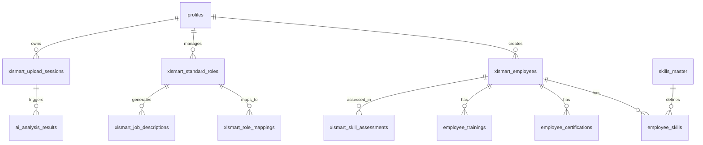

# Database Schema Documentation

## Overview

The XLSmart HR Analytics platform uses PostgreSQL with Supabase as the backend. The database is designed to handle employee data, role standardization, AI analysis, and workforce analytics with a focus on data integrity and security.

## Schema Design Principles

- **Row Level Security (RLS)**: All tables implement RLS policies for data security
- **Audit Trails**: Created/updated timestamps on all major entities
- **Referential Integrity**: Foreign key constraints maintain data consistency
- **Type Safety**: Custom enums and constraints ensure data validity
- **Scalability**: Optimized indexes for performance at scale

## Database Diagram



## Core Tables

### User Management

#### `profiles`
User profile information and role-based access control.

```sql
CREATE TABLE public.profiles (
    id UUID PRIMARY KEY DEFAULT gen_random_uuid(),
    user_id UUID NOT NULL UNIQUE REFERENCES auth.users(id) ON DELETE CASCADE,
    email TEXT NOT NULL,
    first_name TEXT,
    last_name TEXT,
    role user_role NOT NULL DEFAULT 'candidate',
    company_name TEXT,
    phone TEXT,
    avatar_url TEXT,
    is_active BOOLEAN NOT NULL DEFAULT true,
    created_at TIMESTAMPTZ NOT NULL DEFAULT now(),
    updated_at TIMESTAMPTZ NOT NULL DEFAULT now()
);

-- Custom enum for user roles
CREATE TYPE user_role AS ENUM ('super_admin', 'hr_manager', 'candidate', 'client');
```

**Purpose**: Central user management with role-based access control
**Key Features**: 
- Links to Supabase Auth users
- Role-based permissions (super_admin, hr_manager, candidate, client)
- Profile information for UI personalization

### Employee Management

#### `xlsmart_employees`
Core employee data repository with role assignment tracking.

```sql
CREATE TABLE public.xlsmart_employees (
    id UUID PRIMARY KEY DEFAULT gen_random_uuid(),
    employee_number TEXT NOT NULL,
    source_company TEXT NOT NULL,
    first_name TEXT NOT NULL,
    last_name TEXT NOT NULL,
    email TEXT NOT NULL,
    phone TEXT,
    current_position TEXT NOT NULL,
    current_department TEXT,
    current_level TEXT,
    hire_date DATE,
    years_of_experience INTEGER,
    salary NUMERIC,
    currency TEXT DEFAULT 'IDR',
    skills JSONB DEFAULT '[]',
    certifications JSONB DEFAULT '[]',
    performance_rating NUMERIC CHECK (performance_rating >= 1 AND performance_rating <= 5),
    is_active BOOLEAN DEFAULT true,
    
    -- Role Assignment Fields
    standard_role_id UUID REFERENCES xlsmart_standard_roles(id),
    ai_suggested_role_id UUID REFERENCES xlsmart_standard_roles(id),
    original_role_title TEXT,
    role_assignment_status TEXT DEFAULT 'pending' CHECK (role_assignment_status IN ('pending', 'assigned', 'approved', 'rejected')),
    assignment_notes TEXT,
    assigned_by UUID REFERENCES profiles(user_id),
    
    -- Audit Fields
    uploaded_by UUID NOT NULL REFERENCES profiles(user_id),
    created_at TIMESTAMPTZ NOT NULL DEFAULT now(),
    updated_at TIMESTAMPTZ NOT NULL DEFAULT now()
);

-- Indexes for performance
CREATE INDEX idx_xlsmart_employees_company ON xlsmart_employees(source_company);
CREATE INDEX idx_xlsmart_employees_role_status ON xlsmart_employees(role_assignment_status);
CREATE INDEX idx_xlsmart_employees_department ON xlsmart_employees(current_department);
```

**Purpose**: Comprehensive employee data management with AI role assignment
**Key Features**:
- Employee profile and contact information
- Current role and compensation data
- AI-suggested role assignments with approval workflow
- Bulk upload and processing support

#### `employee_skills`
Employee skill associations with proficiency levels.

```sql
CREATE TABLE public.employee_skills (
    id UUID PRIMARY KEY DEFAULT gen_random_uuid(),
    employee_id UUID NOT NULL REFERENCES xlsmart_employees(id) ON DELETE CASCADE,
    skill_id UUID NOT NULL REFERENCES skills_master(id) ON DELETE CASCADE,
    input_level INTEGER CHECK (input_level >= 1 AND input_level <= 5),
    ai_assessed_level INTEGER CHECK (ai_assessed_level >= 1 AND ai_assessed_level <= 5),
    last_assessment_date TIMESTAMPTZ,
    created_at TIMESTAMPTZ NOT NULL DEFAULT now(),
    updated_at TIMESTAMPTZ NOT NULL DEFAULT now(),
    
    UNIQUE(employee_id, skill_id)
);

CREATE INDEX idx_employee_skills_employee ON employee_skills(employee_id);
CREATE INDEX idx_employee_skills_skill ON employee_skills(skill_id);
```

**Purpose**: Track employee skills with both self-reported and AI-assessed proficiency levels
**Key Features**:
- 5-point proficiency scale (Beginner to Expert)
- AI assessment integration
- Unique constraint prevents duplicate skill entries

#### `employee_certifications`
Professional certifications and credentials.

```sql
CREATE TABLE public.employee_certifications (
    id UUID PRIMARY KEY DEFAULT gen_random_uuid(),
    employee_id UUID NOT NULL REFERENCES xlsmart_employees(id) ON DELETE CASCADE,
    certification_name TEXT NOT NULL,
    issuing_authority TEXT,
    issue_date DATE,
    expiry_date DATE,
    certificate_url TEXT,
    created_at TIMESTAMPTZ NOT NULL DEFAULT now()
);

CREATE INDEX idx_employee_certifications_employee ON employee_certifications(employee_id);
CREATE INDEX idx_employee_certifications_expiry ON employee_certifications(expiry_date) WHERE expiry_date IS NOT NULL;
```

**Purpose**: Track professional certifications and their validity
**Key Features**:
- Certification metadata and verification links
- Expiry tracking for compliance management
- Support for certificate document storage

#### `employee_trainings`
Training programs and completion records.

```sql
CREATE TABLE public.employee_trainings (
    id UUID PRIMARY KEY DEFAULT gen_random_uuid(),
    employee_id UUID NOT NULL REFERENCES xlsmart_employees(id) ON DELETE CASCADE,
    training_name TEXT NOT NULL,
    training_provider TEXT,
    completion_date DATE,
    duration_hours INTEGER,
    certificate_url TEXT,
    created_at TIMESTAMPTZ NOT NULL DEFAULT now()
);

CREATE INDEX idx_employee_trainings_employee ON employee_trainings(employee_id);
CREATE INDEX idx_employee_trainings_completion ON employee_trainings(completion_date);
```

**Purpose**: Track employee training and development activities
**Key Features**:
- Training completion tracking
- Duration and provider information
- Certificate storage integration

### Role Management

#### `xlsmart_standard_roles`
Standardized role definitions and requirements.

```sql
CREATE TABLE public.xlsmart_standard_roles (
    id UUID PRIMARY KEY DEFAULT gen_random_uuid(),
    role_title TEXT NOT NULL,
    job_family TEXT NOT NULL,
    role_level TEXT NOT NULL,
    role_category TEXT NOT NULL,
    department TEXT NOT NULL,
    standard_description TEXT,
    
    -- Role Requirements (JSONB Arrays)
    core_responsibilities JSONB DEFAULT '[]',
    required_skills JSONB DEFAULT '[]',
    education_requirements JSONB DEFAULT '[]',
    keywords JSONB DEFAULT '[]',
    
    -- Experience Requirements
    experience_range_min INTEGER DEFAULT 0,
    experience_range_max INTEGER DEFAULT 50,
    
    -- Metadata
    salary_grade TEXT,
    industry_alignment TEXT DEFAULT 'Telecommunications',
    is_active BOOLEAN DEFAULT true,
    version INTEGER DEFAULT 1,
    
    -- Audit Fields
    created_by UUID NOT NULL REFERENCES profiles(user_id),
    approved_by UUID REFERENCES profiles(user_id),
    created_at TIMESTAMPTZ NOT NULL DEFAULT now(),
    updated_at TIMESTAMPTZ NOT NULL DEFAULT now()
);

-- Indexes for search and filtering
CREATE INDEX idx_standard_roles_title ON xlsmart_standard_roles(role_title);
CREATE INDEX idx_standard_roles_category ON xlsmart_standard_roles(role_category);
CREATE INDEX idx_standard_roles_department ON xlsmart_standard_roles(department);
CREATE INDEX idx_standard_roles_level ON xlsmart_standard_roles(role_level);
CREATE INDEX idx_standard_roles_active ON xlsmart_standard_roles(is_active);
```

**Purpose**: Master catalog of standardized role definitions
**Key Features**:
- Hierarchical role organization (family, level, category)
- Structured requirements in JSONB format
- Version control and approval workflow
- Industry-specific alignment

#### `xlsmart_role_mappings`
Mapping between original and standardized roles.

```sql
CREATE TABLE public.xlsmart_role_mappings (
    id UUID PRIMARY KEY DEFAULT gen_random_uuid(),
    catalog_id UUID NOT NULL,
    original_role_title TEXT NOT NULL,
    original_department TEXT,
    original_level TEXT,
    
    -- Standardized Mappings
    standard_role_id UUID REFERENCES xlsmart_standard_roles(id),
    standardized_role_title TEXT NOT NULL,
    standardized_department TEXT,
    standardized_level TEXT,
    job_family TEXT,
    
    -- AI Analysis
    mapping_confidence NUMERIC DEFAULT 0.0 CHECK (mapping_confidence >= 0 AND mapping_confidence <= 1),
    mapping_status TEXT NOT NULL DEFAULT 'auto_mapped' CHECK (mapping_status IN ('auto_mapped', 'manual_review', 'approved', 'rejected')),
    requires_manual_review BOOLEAN DEFAULT false,
    
    -- Review Process
    reviewed_by UUID REFERENCES profiles(user_id),
    reviewed_at TIMESTAMPTZ,
    
    -- Audit Fields
    created_at TIMESTAMPTZ NOT NULL DEFAULT now(),
    updated_at TIMESTAMPTZ NOT NULL DEFAULT now()
);

CREATE INDEX idx_role_mappings_catalog ON xlsmart_role_mappings(catalog_id);
CREATE INDEX idx_role_mappings_confidence ON xlsmart_role_mappings(mapping_confidence);
CREATE INDEX idx_role_mappings_status ON xlsmart_role_mappings(mapping_status);
CREATE INDEX idx_role_mappings_review ON xlsmart_role_mappings(requires_manual_review);
```

**Purpose**: Track the mapping between original role titles and standardized roles
**Key Features**:
- AI confidence scoring for mapping quality
- Manual review workflow for low-confidence mappings
- Comprehensive audit trail for mapping decisions

### Skills Management

#### `skills_master`
Master catalog of skills and competencies.

```sql
CREATE TABLE public.skills_master (
    id UUID PRIMARY KEY DEFAULT gen_random_uuid(),
    name TEXT NOT NULL UNIQUE,
    category TEXT NOT NULL,
    description TEXT,
    created_at TIMESTAMPTZ NOT NULL DEFAULT now()
);

-- Indexes for search and categorization
CREATE INDEX idx_skills_master_category ON skills_master(category);
CREATE INDEX idx_skills_master_name ON skills_master(name);
```

**Purpose**: Centralized skills taxonomy for consistent skill tracking
**Key Features**:
- Categorized skill organization
- Unique skill names to prevent duplicates
- Foundation for skills-based analytics

### Job Descriptions

#### `xlsmart_job_descriptions`
AI-generated and managed job descriptions.

```sql
CREATE TABLE public.xlsmart_job_descriptions (
    id UUID PRIMARY KEY DEFAULT gen_random_uuid(),
    title TEXT NOT NULL,
    summary TEXT,
    
    -- Job Requirements (JSONB Arrays)
    responsibilities JSONB DEFAULT '[]',
    required_qualifications JSONB DEFAULT '[]',
    preferred_qualifications JSONB DEFAULT '[]',
    required_skills JSONB DEFAULT '[]',
    preferred_skills JSONB DEFAULT '[]',
    
    -- Job Details
    experience_level TEXT,
    education_level TEXT,
    salary_range_min NUMERIC,
    salary_range_max NUMERIC,
    currency TEXT DEFAULT 'IDR',
    employment_type TEXT DEFAULT 'full_time' CHECK (employment_type IN ('full_time', 'part_time', 'contract', 'internship')),
    location_type TEXT DEFAULT 'office' CHECK (location_type IN ('office', 'remote', 'hybrid')),
    
    -- AI Generation
    ai_generated BOOLEAN DEFAULT true,
    ai_prompt_used TEXT,
    tone TEXT DEFAULT 'professional' CHECK (tone IN ('professional', 'casual', 'innovative', 'corporate')),
    language TEXT DEFAULT 'id' CHECK (language IN ('en', 'id')),
    
    -- Workflow
    status TEXT NOT NULL DEFAULT 'draft' CHECK (status IN ('draft', 'review', 'approved', 'published')),
    
    -- Relationships
    standard_role_id UUID REFERENCES xlsmart_standard_roles(id),
    
    -- Audit Fields
    generated_by UUID NOT NULL REFERENCES profiles(user_id),
    reviewed_by UUID REFERENCES profiles(user_id),
    approved_by UUID REFERENCES profiles(user_id),
    created_at TIMESTAMPTZ NOT NULL DEFAULT now(),
    updated_at TIMESTAMPTZ NOT NULL DEFAULT now()
);

CREATE INDEX idx_job_descriptions_status ON xlsmart_job_descriptions(status);
CREATE INDEX idx_job_descriptions_role ON xlsmart_job_descriptions(standard_role_id);
CREATE INDEX idx_job_descriptions_employment_type ON xlsmart_job_descriptions(employment_type);
```

**Purpose**: AI-generated job descriptions with approval workflow
**Key Features**:
- Structured job requirements in JSONB format
- Multi-language and tone support
- Approval workflow for quality control
- Integration with standardized roles

### Analytics & Assessment

#### `xlsmart_skill_assessments`
Employee skill assessments and gap analysis.

```sql
CREATE TABLE public.xlsmart_skill_assessments (
    id UUID PRIMARY KEY DEFAULT gen_random_uuid(),
    employee_id UUID NOT NULL REFERENCES xlsmart_employees(id),
    job_description_id UUID REFERENCES xlsmart_job_descriptions(id),
    
    -- Assessment Results
    overall_match_percentage NUMERIC DEFAULT 0.0 CHECK (overall_match_percentage >= 0 AND overall_match_percentage <= 100),
    skill_gaps JSONB DEFAULT '[]',
    next_role_recommendations JSONB DEFAULT '[]',
    level_fit_score NUMERIC DEFAULT 0.0,
    rotation_risk_score NUMERIC DEFAULT 0.0,
    churn_risk_score NUMERIC DEFAULT 0.0,
    
    -- AI Analysis
    ai_analysis TEXT,
    recommendations TEXT,
    
    -- Audit Fields
    assessment_date TIMESTAMPTZ NOT NULL DEFAULT now(),
    assessed_by UUID NOT NULL REFERENCES profiles(user_id),
    created_at TIMESTAMPTZ NOT NULL DEFAULT now(),
    updated_at TIMESTAMPTZ NOT NULL DEFAULT now()
);

CREATE INDEX idx_skill_assessments_employee ON xlsmart_skill_assessments(employee_id);
CREATE INDEX idx_skill_assessments_job ON xlsmart_skill_assessments(job_description_id);
CREATE INDEX idx_skill_assessments_date ON xlsmart_skill_assessments(assessment_date);
```

**Purpose**: Comprehensive skill gap analysis and career progression planning
**Key Features**:
- Match percentage scoring between employee and role requirements
- Risk assessment for retention planning
- AI-powered recommendations for career development

#### `skill_gap_analysis`
Detailed skill gap analysis results.

```sql
CREATE TABLE public.skill_gap_analysis (
    id UUID PRIMARY KEY DEFAULT gen_random_uuid(),
    employee_id UUID NOT NULL REFERENCES xlsmart_employees(id),
    job_description_id UUID NOT NULL REFERENCES xlsmart_job_descriptions(id),
    overall_match_percentage NUMERIC,
    skill_gaps JSONB,
    development_roadmap TEXT,
    ai_recommendations TEXT,
    analysis_date TIMESTAMPTZ NOT NULL DEFAULT now(),
    created_by UUID NOT NULL REFERENCES profiles(user_id)
);

CREATE INDEX idx_skill_gap_analysis_employee ON skill_gap_analysis(employee_id);
CREATE INDEX idx_skill_gap_analysis_job ON skill_gap_analysis(job_description_id);
```

**Purpose**: Detailed skill gap analysis for development planning
**Key Features**:
- Specific skill gap identification
- Development roadmap recommendations
- AI-powered career guidance

### AI & Processing

#### `ai_analysis_results`
Results from AI processing and analysis operations.

```sql
CREATE TABLE public.ai_analysis_results (
    id UUID PRIMARY KEY DEFAULT gen_random_uuid(),
    analysis_type TEXT NOT NULL,
    function_name TEXT NOT NULL,
    input_parameters JSONB NOT NULL DEFAULT '{}',
    analysis_result JSONB NOT NULL DEFAULT '{}',
    status TEXT NOT NULL DEFAULT 'completed' CHECK (status IN ('processing', 'completed', 'error')),
    
    -- Audit Fields
    created_by UUID NOT NULL REFERENCES profiles(user_id),
    created_at TIMESTAMPTZ NOT NULL DEFAULT now(),
    updated_at TIMESTAMPTZ NOT NULL DEFAULT now()
);

CREATE INDEX idx_ai_analysis_type ON ai_analysis_results(analysis_type);
CREATE INDEX idx_ai_analysis_function ON ai_analysis_results(function_name);
CREATE INDEX idx_ai_analysis_status ON ai_analysis_results(status);
CREATE INDEX idx_ai_analysis_created_by ON ai_analysis_results(created_by);
```

**Purpose**: Track AI processing results and maintain analysis history
**Key Features**:
- Flexible JSONB storage for various analysis types
- Status tracking for long-running operations
- Audit trail for AI decision making

#### `xlsmart_upload_sessions`
Upload session tracking and progress monitoring.

```sql
CREATE TABLE public.xlsmart_upload_sessions (
    id UUID PRIMARY KEY DEFAULT gen_random_uuid(),
    session_name TEXT NOT NULL,
    status TEXT DEFAULT 'uploading' CHECK (status IN ('uploading', 'processing', 'completed', 'error')),
    file_names TEXT[] NOT NULL,
    temp_table_names TEXT[] NOT NULL,
    total_rows INTEGER DEFAULT 0,
    ai_analysis JSONB DEFAULT '{}',
    error_message TEXT,
    
    -- Audit Fields
    created_by UUID NOT NULL REFERENCES profiles(user_id),
    created_at TIMESTAMPTZ DEFAULT now(),
    updated_at TIMESTAMPTZ DEFAULT now()
);

CREATE INDEX idx_upload_sessions_status ON xlsmart_upload_sessions(status);
CREATE INDEX idx_upload_sessions_created_by ON xlsmart_upload_sessions(created_by);
CREATE INDEX idx_upload_sessions_created_at ON xlsmart_upload_sessions(created_at);
```

**Purpose**: Track file upload sessions and processing progress
**Key Features**:
- Multi-file upload support
- Progress tracking for real-time updates
- Error handling and recovery

## Row Level Security (RLS) Policies

### Security Functions

```sql
-- Get current user role (prevents RLS infinite recursion)
CREATE OR REPLACE FUNCTION public.get_current_user_role()
RETURNS TEXT AS $$
  SELECT COALESCE(role::text, 'candidate') 
  FROM public.profiles 
  WHERE user_id = auth.uid();
$$ LANGUAGE SQL SECURITY DEFINER STABLE;

-- Update timestamp trigger
CREATE OR REPLACE FUNCTION public.update_updated_at_column()
RETURNS TRIGGER AS $$
BEGIN
  NEW.updated_at = now();
  RETURN NEW;
END;
$$ LANGUAGE plpgsql SECURITY DEFINER;
```

### Key RLS Policies

#### Employee Data Access
```sql
-- Authenticated users can view employees
CREATE POLICY "Authenticated users can view employees" 
ON xlsmart_employees FOR SELECT 
USING (auth.uid() IS NOT NULL);

-- HR managers can manage employees
CREATE POLICY "HR managers can manage employees" 
ON xlsmart_employees FOR ALL 
USING (get_current_user_role() = ANY (ARRAY['super_admin', 'hr_manager']));
```

#### Role Management Access
```sql
-- Authenticated users can view standard roles
CREATE POLICY "Authenticated users can view standard roles" 
ON xlsmart_standard_roles FOR SELECT 
USING (auth.uid() IS NOT NULL);

-- HR managers can manage roles
CREATE POLICY "HR managers can manage standard roles" 
ON xlsmart_standard_roles FOR ALL 
USING (get_current_user_role() = ANY (ARRAY['super_admin', 'hr_manager']));
```

## Data Relationships

### Primary Relationships
- **profiles** → **xlsmart_employees** (One-to-Many: User creates employees)
- **xlsmart_employees** → **employee_skills** (One-to-Many: Employee has skills)
- **skills_master** → **employee_skills** (One-to-Many: Skill referenced by employees)
- **xlsmart_standard_roles** → **xlsmart_role_mappings** (One-to-Many: Role maps to originals)
- **xlsmart_employees** → **xlsmart_skill_assessments** (One-to-Many: Employee assessed)

### Data Flow
1. **Upload**: Files uploaded → `xlsmart_upload_sessions` created
2. **Processing**: Employee data → `xlsmart_employees` table
3. **AI Analysis**: Skills assessed → `xlsmart_skill_assessments` created
4. **Role Assignment**: AI suggests → `xlsmart_role_mappings` updated
5. **Analytics**: Data aggregated for reporting

## Indexes and Performance

### Critical Indexes
- **Employee search**: `idx_xlsmart_employees_company`, `idx_xlsmart_employees_department`
- **Role filtering**: `idx_standard_roles_category`, `idx_standard_roles_level`
- **Skill analysis**: `idx_employee_skills_employee`, `idx_skill_assessments_employee`
- **Upload tracking**: `idx_upload_sessions_status`, `idx_upload_sessions_created_by`

### Query Optimization
- JSONB indexes on frequently queried JSON fields
- Partial indexes on filtered columns (e.g., active records only)
- Composite indexes for common query patterns

## Data Integrity Constraints

### Check Constraints
- **Rating scales**: 1-5 scale for performance ratings and skill levels
- **Status values**: Enum-like constraints for status fields
- **Confidence scores**: 0-1 range for AI confidence values

### Foreign Key Constraints
- **Cascade deletes**: Employee deletion removes related skills/assessments
- **Reference integrity**: All user references link to profiles table
- **Soft references**: Optional foreign keys for flexible relationships

## Backup and Maintenance

### Automated Maintenance
- **Timestamp triggers**: Auto-update `updated_at` fields
- **Cleanup procedures**: Remove old temporary tables
- **Index maintenance**: Regular reindexing for performance

### Data Retention
- **Upload sessions**: Retain for 90 days for debugging
- **AI analysis results**: Retain indefinitely for audit trail
- **Employee data**: Retain per company data retention policies

This schema provides a robust foundation for HR analytics while maintaining data integrity, security, and performance at scale.